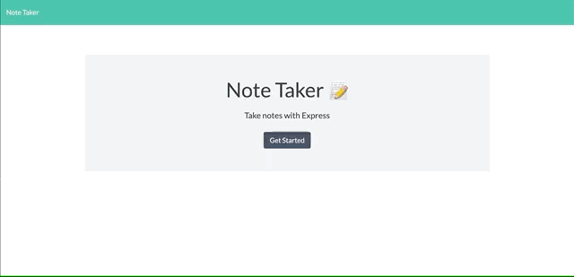

# 11-express
## Note Taker
## The Repository
This repository (`11-express`) is where my Note Taker app resides [Note Taker App](https://boiling-harbor-05515.herokuapp.com/).  The Note Taker will be used to Create a new notes.  Update a current notes, and lastly delete notes.
### Description
* This application will allow you to be able to write and save notes. Be able to delete notes you've written before, and allows the user to keep track of task.
### Usage
To use the app click the "Get Started" button on the main page.  This will direct you the /notes route, where you can create, update, and delete your notes.
### Link
[Note Taker App](https://boiling-harbor-05515.herokuapp.com/)
# Note Take Demo:

  

